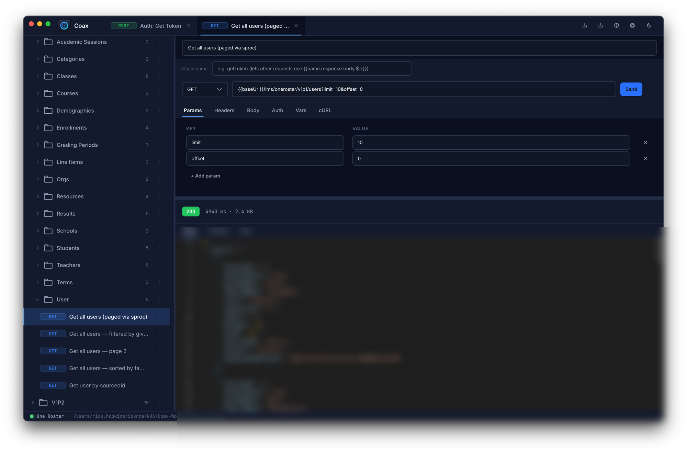

# Coax

> The desktop app for your `.http` files.

[](https://github.com/NationalHeritageAcademies/coax/actions/workflows/ci.yml)
[](LICENSE)
[](https://www.electronjs.org)
[](https://angular.dev)

A free, open-source (MIT), cross-platform desktop client for `.http` files — the format used by VS Code REST Client and JetBrains HTTP Client. Open existing `.http` files, edit them in a polished UI, manage environments and secrets, and execute requests against any HTTP endpoint.



Built with Electron + TypeScript and an [Angular](https://angular.dev) renderer.

**Download:** grab the latest installer for macOS, Windows, or Linux from [GitHub Releases](https://github.com/NationalHeritageAcademies/coax/releases).

```
┌─────────────────────────────────────────────────────────────────┐
│  ●─● Coax   Env: [dev ▾] + ───── tab1 · tab2 · + ───  ⚙ ⬇ ⬆ ☾ │
├──────────────────┬──────────────────────────────────────────────┤
│ COLLECTIONS      │ Chain name: getToken                          │
│  ▾ oneroster     │ [POST ▾] {{baseUrl}}/token        [ Send → ] │
│    ▸ Auth        │  Params · Headers · Body · Auth · Vars · cURL │
│    ▾ Users       │  ┌───────────────────────────────────────┐   │
│      • Get all   │  │ { "clientCode": "...", "scope": "..." │   │
│      • Get by id │  │ }                                     │   │
│      • New       │  └───────────────────────────────────────┘   │
│  ▸ Schools       │ ─── 200 OK · 142 ms · 4.2 KB ─────────────── │
│                  │  Body · Headers · Raw                         │
│                  │  { "access_token": "eyJhbGc...", ... }        │
└──────────────────┴──────────────────────────────────────────────┘
  ● Default · ~/Library/Application Support/Coax/workspaces/...
```

## Quick start

Install from [GitHub Releases](https://github.com/NationalHeritageAcademies/coax/releases), or build from source:

```bash
git clone https://github.com/NationalHeritageAcademies/coax.git
cd coax
npm install
npm run dev          # launches the app in development mode
```

To build a packaged app for your OS:

```bash
npm run build
npm run package      # produces dist/Coax-X.Y.Z-<arch>.dmg|exe|AppImage
```

(Unsigned local builds work fine — the signing/notarization steps only run when the corresponding credentials are present in your environment; see `.env.example`.)

Open the app, click the **⬇ Import** button in the header, and pick a `.http` file. The example files in `examples/` are a good starting point.

## What works

- **Open `.http` files** as collections — variable definitions become an environment, `### Title` blocks become requests, `############` comment dividers become folders, `# @name foo` becomes a chain name
- **Send any HTTP request** — GET/POST/PUT/PATCH/DELETE/HEAD/OPTIONS, with custom headers, JSON/form/text/multipart bodies, query params, and Bearer/Basic/API Key auth
- **Variable substitution** with `{{var}}` syntax across URL, headers, and body
- **Layered environments** — global → collection → request, plus built-ins (`{{$timestamp}}`, `{{$guid}}`, `{{$randomInt 1 10}}`)
- **Encrypted secrets** — variables marked secret are encrypted at rest via Electron `safeStorage`
- **Response chaining** — reference another request's last response with `{{name.response.body.$.field}}`
- **Live editing** with autosave; tabs persist across restarts
- **Export collections** as `.http` files with secrets stripped to placeholders

## Documentation

| Topic | Where |
|---|---|
| Full user guide | [docs/user-guide.md](docs/user-guide.md) |
| Variables & environments | [docs/user-guide.md#variables-and-environments](docs/user-guide.md#variables-and-environments) |
| Response chaining | [docs/user-guide.md#response-chaining](docs/user-guide.md#response-chaining) |
| Keyboard shortcuts & UI tour | [docs/user-guide.md#interface-tour](docs/user-guide.md#interface-tour) |
| CLI reference (`coax run` in CI) | [docs/cli.md](docs/cli.md) |
| Privacy details | [docs/privacy.md](docs/privacy.md) |
| Feature design docs | [docs/plans/](docs/plans/) |
| Architecture (for contributors) | [docs/superpowers/specs/2026-05-14-http-ui-design.md](docs/superpowers/specs/2026-05-14-http-ui-design.md) |

## Project layout

```
src/
  parser/      .http file parser & serializer (pure TypeScript, no Electron)
  resolver/    Variable resolver: layered scopes + built-ins + JSONPath chain refs
  storage/     SQLite via better-sqlite3 — workspaces, collections, requests, envs, vars
  secrets/     Wrapper around Electron safeStorage for encrypted variables
  runner/      HTTP runner using undici (with cancel + timeout)
  ipc/         Typed IPC contract between renderer and main process
  app/         Electron main process glue (dispatcher, file dialogs, lifecycle)
  ui/          Renderer — Angular 21 (zoneless, signals)
docs/          User-facing documentation
examples/      Sample .http files (OneRoster API spec)
tests/         Vitest unit + integration tests
tests-e2e/     Playwright end-to-end test against the packaged Electron app
```

## Scripts

| Command | What it does |
|---|---|
| `npm run dev` | Launch the app in development mode (hot reload) |
| `npm run build` | Build production bundles into `out/` |
| `npm run package` | Package the app into a platform installer (`dist/`) |
| `npm test` | Run the Vitest unit/integration suite |
| `npm run test:e2e` | Build and run the Playwright E2E test |
| `npm run typecheck` | TypeScript type check (no emit) |

## Tech stack

- **Electron** 33 with strict context isolation, no Node integration in the renderer
- **TypeScript** with `strict`, `noUncheckedIndexedAccess`, `exactOptionalPropertyTypes`
- **Angular** 21 (zoneless change detection, signals) for the renderer UI
- **Monaco Editor** for body and response code editing
- **better-sqlite3** for the workspace database
- **undici** for HTTP execution in a dedicated Node worker
- **electron-vite** for the build, **electron-builder** for packaging
- **Vitest** for unit tests, **Playwright** for end-to-end

## Contributing

Contributions are welcome — bug reports, feature requests, and pull requests.
See [CONTRIBUTING.md](CONTRIBUTING.md) for dev setup, how to run the test
suites, and what to expect from the PR process. For anything non-trivial,
open an issue first so we can agree on the approach before you invest time.

Found a security issue? Please follow [SECURITY.md](SECURITY.md) instead of
opening a public issue.

## Roadmap

Feature design docs for likely future work live in
[docs/plans/](docs/plans/) — pre-request scripts, Postman/Insomnia/Bruno
importers, GraphQL/WebSocket/SSE support, and deeper git integration.

## Telemetry

None. Coax makes no network calls except the HTTP requests you send and
the GitHub Releases check for updates (which you can turn off in
Settings). The upstream project's opt-in Sentry crash reporting was
removed in the NHA fork.

## License

[MIT](LICENSE) © Rick Hopkins (Melodic Development).

This repository is the National Heritage Academies fork of
[MelodicDevelopment/coax](https://github.com/MelodicDevelopment/coax), maintained
for NHA's internal tooling. Releases here are built and published by NHA.
